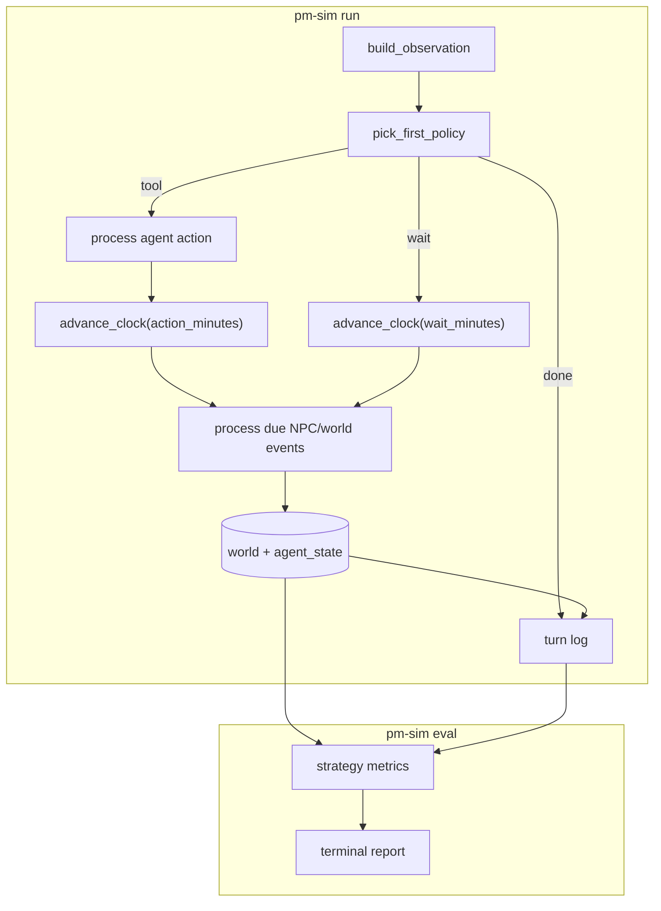

# Architecture

This document describes how the PM simulation is structured. For reviewer usage, see [README.md](../README.md).

## Overview

The simulator is a single Python process driven by the CLI. All world state lives in a local SQLite database (`data/sim.db`). There is no database server, no web UI, and no LLM in the core loop.

Key design choices:

- **Sim time vs wall time:** The sim clock advances when the agent takes any action — tool turns cost `action_durations` minutes (per-action defaults overridable in `scenario.yaml`), `wait` costs `wait_minutes`. Wall-clock runtime is independent of sim time.
- **Determinism:** NPC replies, drift events, and eval scores are deterministic given the same scenario seed and agent policy.
- **Event queue:** SQLite `events` table is the priority queue. Handlers process due events and may enqueue follow-up events.

## Run loop

Explicit simulated clock decoupled from wall time. No background jobs — scheduled events process when a turn advances the clock past their `start_ts`.

Each turn:

1. Build an observation snapshot from DB state
2. Pick the first matching policy rule (top-to-bottom, first match wins)
3. Execute the agent action: `tool`, `wait`, or `done`
4. **Tool turns:** process due events at T, advance clock by action duration, process due events at T+N
5. **Wait turns:** advance clock by `wait_minutes`, then process due events
6. Log the turn (collapsing consecutive identical blocks) and repeat until stop conditions

Consecutive turns with the same OBSERVE/ACTION/RESULT body are collapsed into one ranged entry in `turn.log` and updated in place on stdout during long `wait` streaks. `action_log.json` retains every turn.


| Agent action | Sim clock | What runs                                                         |
| ------------ | --------- | ----------------------------------------------------------------- |
| Tool (any)   | +N min    | Insert agent event at `now` → drain → advance N min → drain again |
| `wait`       | +1 min    | Advance clock → fetch due events → drain                          |
| `done`       | Unchanged | Exit                                                              |





```python
def run(scenario, agent_spec, db):
    while not should_stop(db, scenario):
        observation = build_observation(db)
        action = pick_first_policy(agent_spec.policies, observation)

        if action.type == "done":
            break
        elif action.type == "wait":
            advance_clock(db, minutes=wait_minutes)
            process_due_events(db)
        else:
            insert_event(db, AgentActionEvent(start_ts=get_sim_time(db), action=action))
            process_due_events(db)
            advance_clock(db, minutes=action_duration(action))
            process_due_events(db)

        log_and_print_turn(...)
    write_run_summary(db)


CREATE TABLE events (
    id TEXT PRIMARY KEY,
    event_type TEXT NOT NULL,
    start_ts TEXT NOT NULL,
    source TEXT NOT NULL,
    actor_id TEXT,
    payload TEXT NOT NULL,
    status TEXT NOT NULL DEFAULT 'pending',
    visibility TEXT NOT NULL DEFAULT 'public'
);
CREATE INDEX idx_events_pending_due
    ON events(start_ts, id) WHERE status = 'pending';
```


| Agent picks              | Run loop does                                               | Sim clock               |
| ------------------------ | ----------------------------------------------------------- | ----------------------- |
| **Tool** (read or write) | Insert agent event at `now` → drain → advance → drain again | +`action_durations` min |
| `**wait`**               | Advance clock → process due events                          | +`wait_minutes`         |
| `**done`**               | Exit loop                                                   | Unchanged               |


Every tool — `tasks list`, `chat read`, `chat send`, etc. — uses the **same path**: insert agent event row → process due events at T → advance clock by action duration → process due events at T+N. Handlers call the tool layer (§12) and update `agent_state`. No special read-only branch.

Both tool and `wait` turns advance sim time. Per-action costs default in code (`src/pm_sim/sim/action_duration.py`) and are overridable in `scenario.yaml` under `sim.action_durations` and `sim.wait_minutes`.

### What happens on `wait` (after `advance_clock`)

1. `**advance_clock(wait_minutes)`** — sim time T → T+wait_minutes.
2. `**process_due_events(db)`** — fetch all pending events with `start_ts <= sim_time`, ordered by `start_ts, id`, run handlers, and repeat until no due events remain.

Handlers create followups by inserting `**new_ev`** rows. Same-time `new_ev` are picked up by the next due-event batch in the same processing cycle; future `new_ev` wait in SQLite until due.

**Example — A sends email to B:**

```text
1. agent.email_send handler runs (during process_due_events)
2. Email written to world
3. Handler creates new_ev: npc.reply from B at start_ts = now + 45min
4. new_ev.start_ts > sim_time  →  insert_event(db, new_ev)   # future → db
5. Later turn crosses 45min  →  fetch_due_events picks up new_ev  →  B replies
```

Same pattern for chat send → NPC reply, vendor escalate → turnaround timer, etc.

**Stop conditions:**

- `scenario.end_time` (Fri 6 PM week 1)
- `max_turns` (default 15000; override via `--max-turns`)
- Agent policy returns `done`

```yaml
# scenario.yaml
sim:
  start_time: "2026-06-22T09:00:00"
  end_time:   "2026-06-26T18:00:00"
  max_turns:  15000
```

## Events

Events are rows in the `events` table, fetched in batches ordered by `start_ts, id`.

```
insert_event → SQLite events table → fetch_due_events → process_due_events → world
```

On any turn, the run loop advances the clock by the action's duration, then drains due events. Tool turns also drain once at the start of the action (before advancing), so handlers can schedule follow-ups that may become due during the action. Handlers may create new events during processing; same-time events are picked up in the next batch, future events stay pending.

Handler registry: `src/pm_sim/sim/handlers/`


| Event type                      | Handler purpose                                         |
| ------------------------------- | ------------------------------------------------------- |
| `agent.*`                       | Agent tool actions (chat, email, tasks, calendar, docs) |
| `npc.reply`                     | Deliver NPC message after latency                       |
| `npc.policy_scan`               | Proactive NPC checks (e.g. Jordan exec pressure)        |
| `task.complete`                 | Mark task done, trigger milestone check                 |
| `milestone.drift`               | Slip launch when critical path stays blocked            |
| `meeting.start` / `meeting.end` | Meeting lifecycle and design gate                       |
| `vendor.turnaround_complete`    | Unblock PROJ-17 after vendor escalation                 |
| `milestone.check`               | Complete milestones when dependency tasks are done      |


Scenario seeds schedule initial events in `scenario.yaml` under `seed.initial_events` and `seed.drift_events`.

## Tools (internal)

Tools in `src/pm_sim/tools/` are thin wrappers around SQLite tables. They are called by agent handlers, not by reviewers.


| Tool     | Tables            | Used for                       |
| -------- | ----------------- | ------------------------------ |
| Chat     | `chat_messages`   | Channels, DMs, mark read, send |
| Email    | `emails`          | Read/send formal comms         |
| Calendar | `calendar_events` | Schedule/list events           |
| Meeting  | `meetings`        | Join, transcript               |
| Task     | `tasks`           | List/update tasks              |
| Doc      | `docs`            | Read/write decision logs       |


## Data model

Schema defined in `src/pm_sim/sim/schema.sql`.


| Table               | Purpose                                           |
| ------------------- | ------------------------------------------------- |
| `sim_meta`          | Sim clock, scenario id, company info, run context |
| `tasks`             | Task graph with status, blockers, dependencies    |
| `milestones`        | Launch and other milestones                       |
| `chat_messages`     | Channel and DM messages                           |
| `emails`            | Inbox messages                                    |
| `calendar_events`   | Scheduled events                                  |
| `meetings`          | Meeting records and transcripts                   |
| `docs`              | Decision logs and other documents                 |
| `events`            | Priority queue of pending/done world events       |
| `agent_state`       | JSON flags updated by handlers                    |
| `coworker_state`    | NPC state (commitments, etc.)                     |
| `coworker_policies` | Resolved template assignments per coworker        |
| `action_log`        | Per-turn agent action audit trail                 |
| `runs`              | Run registry (scenario, agent, status, seed)      |


```sql
-- Sim clock and scenario metadata stored in sim_meta key-value table
CREATE TABLE sim_meta (key TEXT PRIMARY KEY, value TEXT NOT NULL);

CREATE TABLE tasks (
    id TEXT PRIMARY KEY,
    title TEXT NOT NULL,
    status TEXT NOT NULL,           -- todo | in_progress | blocked | done
    owner_id TEXT,
    duration_minutes INTEGER,        -- used when scheduling task.complete
    blocker_reason TEXT,
    critical_path INTEGER DEFAULT 0,
    depends_on TEXT                 -- JSON array of task ids
);

CREATE TABLE chat_messages (
    id TEXT PRIMARY KEY,
    channel TEXT NOT NULL,          -- channel name or dm:<coworker_id>
    sender_id TEXT NOT NULL,
    body TEXT NOT NULL,
    sent_at TEXT NOT NULL,
    read_by_agent INTEGER DEFAULT 0
);

CREATE TABLE agent_state (
    key TEXT PRIMARY KEY,
    value TEXT NOT NULL             -- JSON
);

CREATE TABLE coworker_state (
    coworker_id TEXT PRIMARY KEY,
    availability_until TEXT,
    current_commitments TEXT,       -- JSON
    last_interaction_at TEXT
);

CREATE TABLE coworker_policies (
    coworker_id TEXT NOT NULL,
    template_id TEXT NOT NULL,
    PRIMARY KEY (coworker_id, template_id)
);

CREATE TABLE action_log (
    id INTEGER PRIMARY KEY AUTOINCREMENT,
    run_id TEXT NOT NULL,
    turn INTEGER NOT NULL,
    sim_time TEXT NOT NULL,
    action_type TEXT NOT NULL,
    payload TEXT NOT NULL,
    result TEXT
);

CREATE TABLE runs (
    id TEXT PRIMARY KEY,
    scenario_id TEXT NOT NULL,
    agent_id TEXT NOT NULL,
    status TEXT NOT NULL,
    started_at TEXT NOT NULL,
    ended_at TEXT,
    seed INTEGER NOT NULL
);
```

