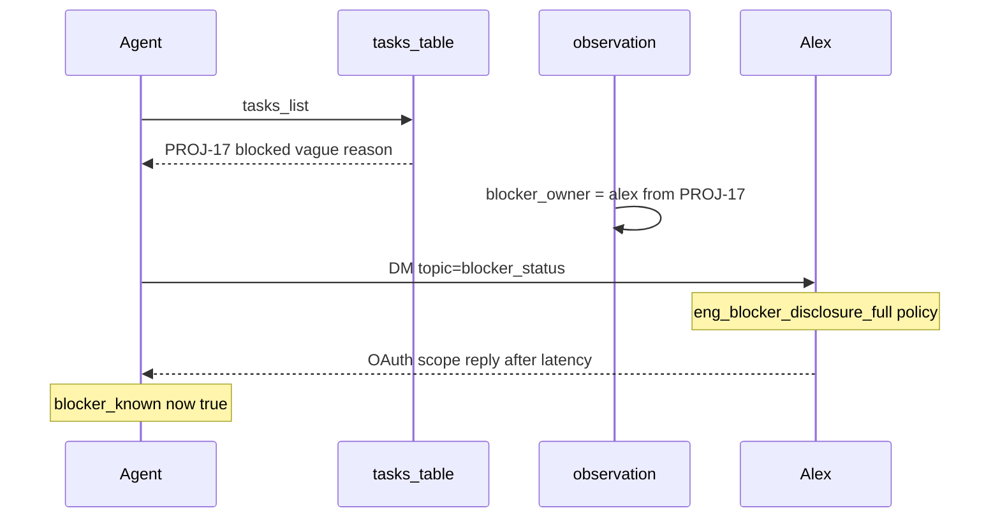

# Scenario Authoring

This guide explains how to create or extend a scenario package under `scenarios/<id>/`. For architecture context, see [architecture.md](architecture.md). For reviewer usage, see [README.md](../README.md).

## Scenario package layout

```
scenarios/my-scenario/
  scenario.yaml           # world seed, sim config, company metadata
  coworkers.yaml          # NPC personas and policy assignments
  policy_templates.yaml   # NPC trigger/condition/action templates
  message_templates.yaml  # NPC reply text
  eval_rubric.yaml        # Ground-truth evaluation rubric
  agents/                 # Agent persona policy specs (optional)
    triage_first.yaml
    spam_ping.yaml
```

## Required files

Validated by `validate_scenario()` in `src/pm_sim/scenario/validate.py`:


| File                     | Required | Purpose                                       |
| ------------------------ | -------- | --------------------------------------------- |
| `scenario.yaml`          | yes      | Sim config, company, world seed               |
| `coworkers.yaml`         | yes      | Coworker definitions                          |
| `policy_templates.yaml`  | yes      | NPC policy templates                          |
| `message_templates.yaml` | yes      | NPC message text                              |
| `eval_rubric.yaml`       | yes      | Evaluation rubric                             |
| `agents/*.yaml`          | no       | Agent persona policies for `--compare-agents` |


Missing files or invalid references raise `ScenarioValidationError` on reset. Orphan policy templates (assigned to no coworker) produce warnings.

## scenario.yaml

Top-level sections (see `scenarios/first-week-pm/scenario.yaml` for a complete example):

### `id`

Scenario identifier used on the CLI: `pm-sim scenario reset first-week-pm`.

### `company`

Company metadata seeded into `sim_meta` at reset:

```yaml
company:
  name: Acme SaaS
  product: Launch Platform
  launch_target: "2026-06-26T18:00:00"
  teams:
    - engineering
    - product
```

### `sim`

Simulation clock bounds and safety cap:

```yaml
sim:
  start_time: "2026-06-22T09:00:00"   # Monday 9 AM
  end_time: "2026-06-26T18:00:00"     # Friday 6 PM
  max_turns: 15000
  seed: 42                              # latency RNG seed
  wait_minutes: 1                       # optional; idle wait cost
  action_durations:                     # optional; override per-action minutes
    tasks_list: 2
    ask_blocker_owner_dm: 3
    default: 1
```

All three of `start_time`, `end_time`, and `max_turns` are required. `wait_minutes` and `action_durations` are optional — defaults live in `src/pm_sim/sim/action_duration.py` and are merged on reset into `sim_meta`.


| Action                                                                          | Default minutes |
| ------------------------------------------------------------------------------- | --------------- |
| `tasks_list`                                                                    | 2               |
| `read_dm`, `read_email`                                                         | 2               |
| `ask_blocker_owner_dm`, `spam_ping_dm`, `escalate_vendor`, `send_status_update` | 3               |
| `schedule_requirements_meeting`, `schedule_tradeoff_meeting`                    | 5               |
| `write_decision_doc`                                                            | 10              |
| unlisted / `default`                                                            | 1               |


### `world`

External entity ids referenced by agent actions:

```yaml
world:
  vendor_id: vendor_api
  exec_id: exec
```

### `seed`

Initial world state. Sub-sections:


| Section           | Purpose                                                          |
| ----------------- | ---------------------------------------------------------------- |
| `milestones`      | Launch and other milestones with due dates and task dependencies |
| `tasks`           | Task graph: status, owner, blockers, critical path, dependencies |
| `chat_messages`   | Pre-reset channel/DM messages (appear as unread)                 |
| `emails`          | Pre-reset inbox messages                                         |
| `calendar_events` | Standups, meetings already on the calendar                       |
| `docs`            | Pre-existing documents (e.g. empty decision log)                 |
| `initial_events`  | Scheduled events at reset (e.g. `npc.policy_scan`)               |
| `drift_events`    | Milestone slip triggers (e.g. `milestone.drift`)                 |


**Critical path convention** (hard-validated): tasks `PROJ-17`, `PROJ-22`, `PROJ-30` and milestone `launch` must exist.

#### Milestone launch

```yaml
milestones:
  - id: launch
    title: Feature launch
    due_at: "2026-06-24T18:00:00"
    depends_on_tasks:
      - PROJ-30
```

`depends_on_tasks` lists tasks that must complete before launch can succeed.

#### Tasks (critical path)

```yaml
tasks:
  - id: PROJ-17
    title: API integration
    status: blocked
    owner_id: alex
    blocker_reason: integration issue
    critical_path: true
    depends_on: []
    duration_minutes: 780

  - id: PROJ-22
    title: Design sign-off
    status: blocked
    owner_id: morgan
    blocker_reason: requirements meeting not held
    critical_path: true
    depends_on:
      - PROJ-17
    duration_minutes: 120

  - id: PROJ-30
    title: QA
    status: todo
    owner_id: alex
    critical_path: true
    depends_on:
      - PROJ-17
      - PROJ-22
    duration_minutes: 600
```

Dependency chain: `PROJ-17` → `PROJ-22` → `PROJ-30` → `launch` milestone. Non-critical tasks (e.g. `PROJ-99` with `critical_path: false`) may coexist.

## coworkers.yaml

Defines simulated coworkers:

```yaml
coworkers:
  - id: alex
    name: Alex Chen
    role: engineering
    working_hours:
      start: "09:00"
      end: "18:00"
    response_latency:
      min_minutes: 45
      max_minutes: 180
      seed_key: alex-latency
    goals:
      - protect_engineering_capacity
      - resist_scope_creep
    constraints:
      - no_scope_without_tradeoff
```

`role`, `goals`, `constraints` — matched at reset against each template's `requires_role`, `requires_goal`, and `requires_constraint` in `policy_templates.yaml` (no manual policy list on coworkers).

## policy_templates.yaml

NPC behavior templates:

```yaml
templates:
  - id: eng_blocker_disclosure_full
    requires_role: engineering
    trigger: message_received
    condition: "channel == dm AND topic == blocker_status"
    action: reply_with_full_blocker_details
```

Each template's `action` key must have matching reply text in `message_templates.yaml`.

## Agent personas

Agent YAML files live under `agents/`:

```yaml
id: triage_first
policies:
  - { condition: "NOT tasks_checked", action: tasks_list }
  - { condition: "blocker_unknown AND NOT waiting_on_reply", action: ask_blocker_owner_dm }
  - { condition: "waiting_on_reply", action: wait }
  - { condition: "no_urgent_items", action: wait }
```

Rules are evaluated top-to-bottom; first match wins. Policy order is priority order.

### Available conditions

Defined in `src/pm_sim/agent/conditions.py`:


| Condition                                   | Meaning                                               |
| ------------------------------------------- | ----------------------------------------------------- |
| `tasks_checked`                             | Agent has listed tasks                                |
| `blocker_known` / `blocker_unknown`         | OAuth blocker discovered or not                       |
| `vendor_escalated`                          | Vendor escalation email sent                          |
| `requirements_meeting_held`                 | Requirements meeting completed                        |
| `requirements_meeting_scheduled`            | Requirements meeting on calendar (not yet held)       |
| `tradeoff_meeting_scheduled`                | Tradeoff meeting on calendar                          |
| `tradeoff_documented` / `tradeoff_decision` | Decision log written                                  |
| `stakeholder_conflict_detected`             | Jordan + Sam emails both read                         |
| `stakeholders_not_informed`                 | Blocker known but Sam not briefed                     |
| `unread_dm` / `unread_email`                | Unread messages exist                                 |
| `unread_dm_from <id>`                       | Unread DM from specific coworker                      |
| `waiting_on_reply`                          | Pending NPC reply event                               |
| `can_spam_ping`                             | Fewer than 15 low-value pings sent (round-robin across coworkers) |
| `critical_path_task_ready`                  | A critical-path `todo` task has all dependencies done |
| `no_urgent_items`                           | Nothing urgent remaining                              |


Supports `NOT` and `AND` combinators.

### Available actions

Resolved in `src/pm_sim/agent/actions.py`:


| Action                          | Effect                                                           |
| ------------------------------- | ---------------------------------------------------------------- |
| `tasks_list`                    | List tasks, set `tasks_checked`                                  |
| `ask_blocker_owner_dm`          | DM blocker owner about status                                    |
| `read_dm` / `read_email`        | Read unread messages                                             |
| `escalate_vendor`               | Email vendor for OAuth scope                                     |
| `schedule_requirements_meeting` | Calendar: requirements sync                                      |
| `schedule_tradeoff_meeting`     | Calendar: tradeoff discussion                                    |
| `write_decision_doc`            | Write decision log with options                                  |
| `send_status_update`            | Email status to stakeholders                                     |
| `start_next_critical_task`      | Start the next ready critical-path task (`todo` → `in_progress`) |
| `spam_ping_dm`                  | Low-value ping to a coworker                                     |
| `wait`                          | Advance sim clock +1 min                                         |
| `done`                          | End the run                                                      |


## Checklist for new scenarios

1. Create all five required YAML files under `scenarios/<id>/`
2. Define critical path tasks and launch milestone
3. Seed enough comms that personas have meaningful first actions (chat, email, tasks)
4. Assign NPC policy templates to coworkers; add matching message templates
5. Write agent personas under `agents/` with distinct strategy orderings
6. Author `eval_rubric.yaml` with checks aligned to scenario goals
7. Run `validate_scenario("<id>")` — fix errors, review warnings
8. Reset and run each persona; verify first actions match intent
9. Run `pm-sim eval <id> --compare-agents` and confirm rubric spread across personas
10. Add smoke tests following patterns in `tests/test_scenario.py`

## Agent ↔ Coworker interaction (example)

Agent policies and NPC templates both use `{ condition, action }`, but they govern different actors:


|          | Agent (`agents/*.yaml`)                          | NPC (`policy_templates.yaml`)                                             |
| -------- | ------------------------------------------------ | ------------------------------------------------------------------------- |
| Actor    | PM agent                                         | Coworkers                                                                 |
| When     | Every turn                                       | On trigger (`message_received`, `meeting_attended`, `policy_scan`)        |
| `action` | Tool name (`tasks_list`, `ask_blocker_owner_dm`) | Reply/world action (`reply_with_full_blocker_details`, `unblock_proj_22`) |


Below is one end-to-end interaction from `first-week-pm`:

**Agent picks PROJ-17 → finds owner Alex → asks Alex → Alex replies according to his policy.**

### Beat 1 — Agent picks PROJ-17

Agent policy fires `tasks_list` (`scenarios/first-week-pm/agents/triage_first.yaml`). The task list returns `PROJ-17` as the blocked critical-path task with a vague reason (`integration issue`) — the real OAuth cause is not in the task row (`scenarios/first-week-pm/scenario.yaml` seed).

### Beat 2 — Agent finds owner Alex

Each turn, `build_observation` (`src/pm_sim/agent/observation.py`) resolves `blocker_owner` from the first blocked critical-path task. Because `PROJ-17` has `owner_id: alex`, the agent knows to contact Alex. Agent condition `blocker_unknown` becomes true; policy picks `ask_blocker_owner_dm`.

### Beat 3 — Agent asks Alex

`resolve_action` (`src/pm_sim/agent/actions.py`) sends a DM to `alex` with `topic: blocker_status`. This is an **agent** policy action, not an NPC template.

### Beat 4 — Alex replies according to his policy

At reset, Alex (`role: engineering`) was assigned template `eng_blocker_disclosure_full` via `requires_role` matching (`src/pm_sim/npcs/resolver.py`). When the DM arrives, the NPC resolver picks that template (`trigger: message_received`, `condition: "channel == dm AND topic == blocker_status"`) and schedules an `npc.reply` after Alex's `response_latency` (`scenarios/first-week-pm/coworkers.yaml`). Reply text comes from `message_templates.yaml` (`reply_with_full_blocker_details`); side effect: `PROJ-17_oauth_scope` added to `blockers_known`.




If the agent had posted `topic: blocker_status` in a public channel instead, Alex's `eng_blocker_disclosure_partial` policy would fire and only return vague details — DM vs channel controls how much Alex reveals.

After the reply: agent `read_dm` → `blocker_known` → later `escalate_vendor`. The example ends once Alex's policy reply lands.

**Authoring takeaway:** wire interactions by aligning agent `action` payload fields (especially `topic`) with NPC template `condition`, coworker `role`/`goals` with template `requires_`*, and NPC `action` keys with entries in `message_templates.yaml`.